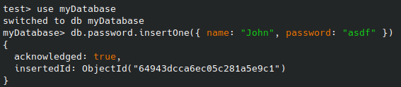
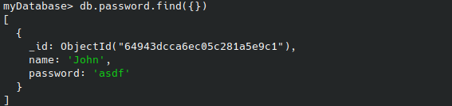
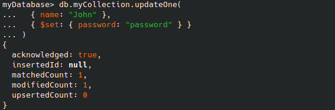
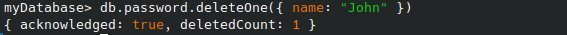

# Password manager with notes

## week 1
We started out project and decided wich programming language we should use. We had two different langauges C# and golang. We decided to use golang because it was easier to write code with it. As web library we used Gin. Gin helps us to create the CRUD operations and to host the website. 

What exactly is GIN? "Gin is a HTTP web framework written in Go (Golang). It features a Martini-like API, but with performance up to 40 times faster than Martini. If you need smashing performance, get yourself some Gin."[source](https://gin-gonic.com/docs/)

Our website is reachable under [localhost:8080](localhost:8080)

## week 2
In our second week we descussed how to deploy our project. We decided to use Docker for an easy deploy mehtod. We now have a docker-compose file wich not only has out mongo database and golang program but also a Mongo express image wich helps looking into the database. This interface is visible at [localhost:8081](localhost:8081). Note that it is not possible to connect to our database from outside the docker container. 
[Mongodb docker image](https://hub.docker.com/_/mongo/)

``` bash
application         # Data for login of our own program
└── users           # The diffrent users
    ├── password
    └── username
myDatabase          # The logindata for extern webistes
├── notes           # Extra Information
│   ├── _id
│   ├── note
│   └── passwordid  # The Password _id for the notes
└── password        # The actual password which should be saved
    ├── _id
    ├── name
    └── password

```

## week 3






# Reflection

While creating this Project we got a better unterstanding about how Mongodb stores data. It was a fun experience to do something new not only the database but also the Go backend which was created with gin. Gin was new for us but made the api much simpler and efficent than with martini. To Mongodb part was pretty easy.
We learned about golang project structure which is not as easy as it seems. An example would be the cmd folder which only exist in golang and replaces the the src or main file. All other files are stored in internal
