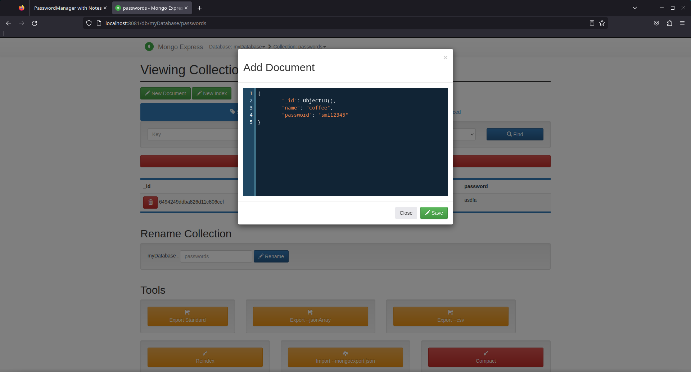

# Password manager with notes

## week 1
We started out project and decided wich programming language we should use. We had two different langauges C# and golang. We decided to use golang because it was easier to write code with it. As web library we used Gin. Gin helps us to create the CRUD operations and to host the website. 

What exactly is GIN? "Gin is a HTTP web framework written in Go (Golang). It features a Martini-like API, but with performance up to 40 times faster than Martini. If you need smashing performance, get yourself some Gin."[source](https://gin-gonic.com/docs/)

Our website is reachable under [localhost:8080](localhost:8080)

## week 2
In our second week we descussed how to deploy our project. We decided to use Docker for an easy deploy mehtod. We now have a docker-compose file wich not only has out mongo database and golang program but also a Mongo express image wich helps looking into the database. This interface is visible at [localhost:8081](localhost:8081). Note that it is not possible to connect to our database from outside the docker container. 
[Mongodb docker image](https://hub.docker.com/_/mongo/)

## week 3
